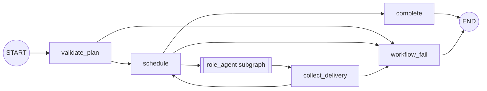
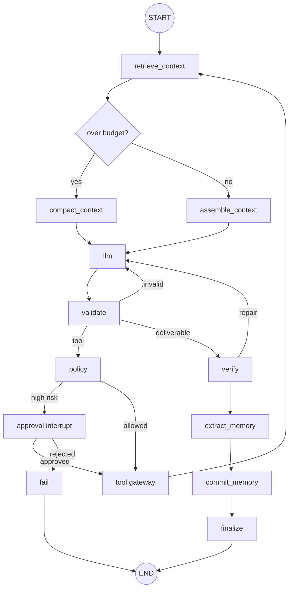

# LangGraph two-level design

## State ownership

| Store | Authoritative for | Recovery unit |
|---|---|---|
| LangGraph checkpointer | node position, graph state, interrupts | super-step |
| Harness SQLite/Postgres | tasks, approvals, tool calls, memories, audit events | business transition |
| Artifact store / Git | patches, reports, test evidence | immutable artifact |

LangGraph state never proves that an external side effect happened. The ToolGateway
ledger remains the source of truth for that question.

## Parent graph

`validate_plan` validates dependency references, roles, and cycles without an LLM.
`schedule` selects only tasks whose dependencies have succeeded and atomically claims
the selected task in the business store. The LLM may propose a plan in a future
planner node, but it cannot bypass deterministic plan validation.

## Reusable role-agent subgraph

Each role supplies only configuration:

- system prompt and prompt version;
- model adapter;
- allowed tool names;
- context and cost budgets;
- task contract and acceptance criteria.

The execution skeleton, approval behavior, checkpoint boundaries, and audit behavior
are shared, so a role cannot silently weaken safety policy.

## Recovery rules

1. Model decisions are persisted both at the LangGraph step boundary and in the
   `agent_steps` ledger. Resuming a completed model step does not sample again.
2. Approval uses `interrupt()` in its own node. No external tool side effect occurs
   before the interrupt.
3. Tool calls use deterministic call IDs derived from task, model step, tool, and
   argument fingerprint.
4. Completed tool calls replay their persisted result.
5. Read-only and idempotent failures may be retried. Non-idempotent ambiguous failures
   become `uncertain` and require reconciliation.
6. Memory extraction produces a candidate first. The following node validates and
   idempotently commits it, preventing an Agent from directly mutating long-term memory.

## Production parallelism

The local implementation serializes ready tasks because SQLite is the demo store.
With Postgres, `schedule` can return one `Send` per ready task. Each branch must use a
stable task-specific checkpoint namespace. Branches return only a `DeliveryManifest`;
a deterministic reducer merges manifests. Parallel branches must never append to a
shared raw message list or write the same artifact path.

